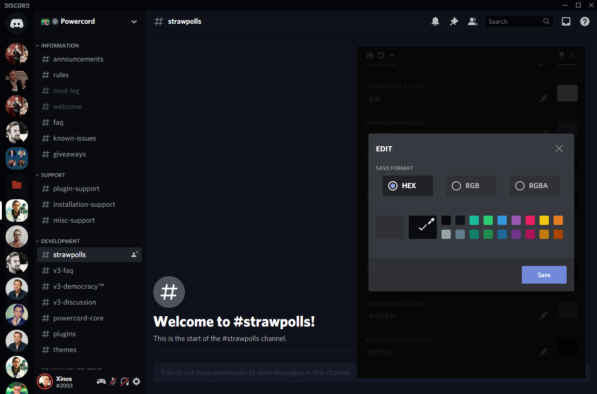
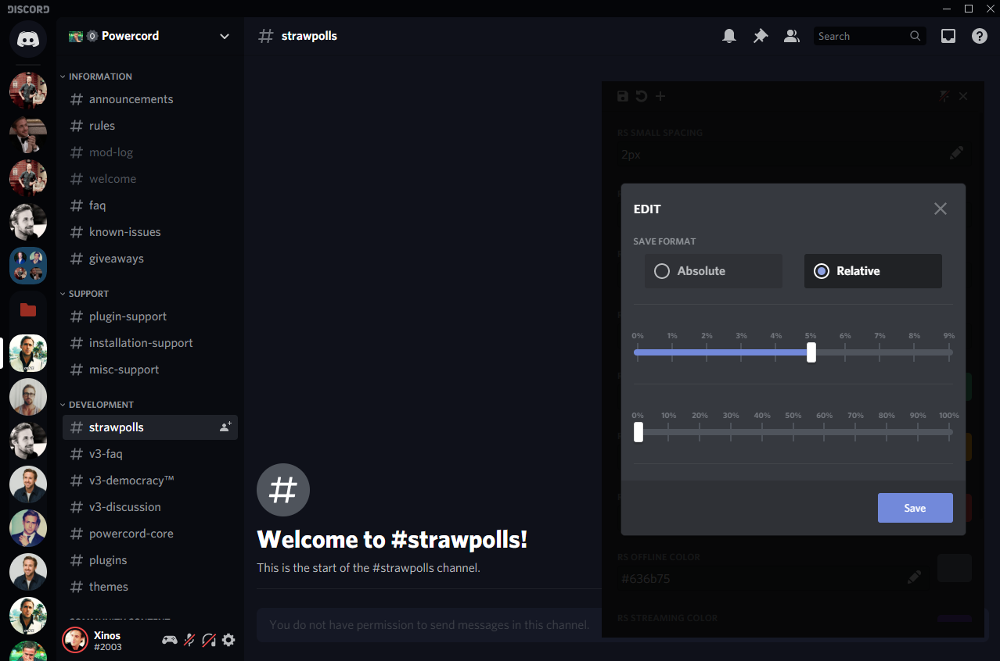
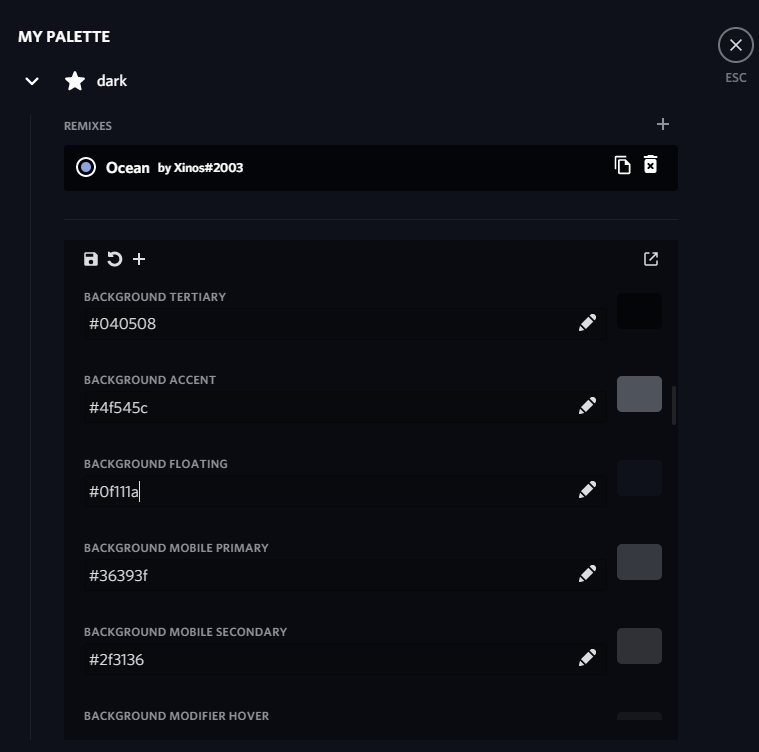

# My palette

> **Warning**
> Powercord client is EOL and no longer works with latest versions of Discord

Adds new UI (in your settings tab) for customizing themes 

A more convenient way to customize your theme variables.
- In settings or in a floating window
- Convert colors to hex / rgb / rgba
- A way to share a custom color palette

### More previews
| 1             | 2         
| ------------- |:-------------:|
 | 
